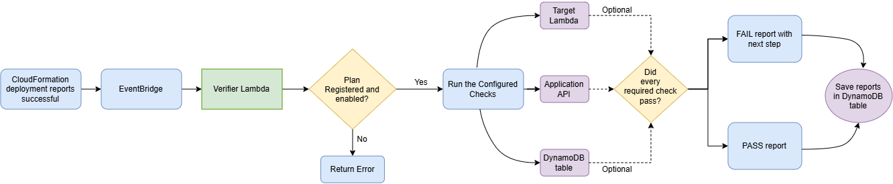

#                                                                            Deployment Application Verifier

CloudFormation can report `CREATE_COMPLETE` or `UPDATE_COMPLETE` even when the
deployed application returns errors. This project closes that gap by collecting
runtime evidence and producing a deterministic, evidence backed PASS or FAIL
report after a deployment.

This repository supports two workflows:

1. A local workflow that evaluates synthetic JSON evidence without AWS.
2. A deployable AWS workflow triggered by CloudFormation status events through
   Amazon EventBridge.

No AI model is used to decide whether a deployment passed. The verdict comes
from explicit, testable rules. Likely causes are kept separate from confirmed
facts so the report never presents a guess as evidence.

## Verification architecture



Solid arrows show the main path. Dotted arrows are optional checks used only
when they are enabled in the verification plan. The rule engine, not an AI
model, decides whether the deployment passes. 

## Why these AWS services are used

| Service | Purpose |
| --- | --- |
| CloudFormation | Deploys the target application and emits its stack status |
| EventBridge | Starts verification only after a successful create or update |
| Lambda | Runs the verifier without a continuously running server |
| API Gateway | Provides IAM protected plan, manual run, and report endpoints |
| DynamoDB | Stores verification plans and short lived reports |
| CloudWatch Logs | Supplies runtime error evidence from the target application |

The target application does not need to use every optional check. An API only
plan is valid. Lambda, CloudWatch, and DynamoDB checks are enabled only when they
are relevant to the application being verified.

## Verification workflow

1. Register a verification plan for a CloudFormation stack name.
2. Deploy or update that stack.
3. CloudFormation sends a stack status event to EventBridge.
4. EventBridge invokes the verifier for completed creates and updates.
5. The verifier ignores unregistered or disabled stacks.
6. It calls the target API and runs any configured Lambda, log, or database
   checks.
7. The rule engine separates confirmed evidence, likely causes, and next steps.
8. The report is stored using the EventBridge event ID as an idempotency key.

Using the event ID prevents a duplicate EventBridge delivery from running the
same synthetic request twice. Stored reports expire automatically after 30 days
by default.

## Report example

The included false green fixture describes this result:

```text
CloudFormation: UPDATE_COMPLETE
API: HTTP 500
Lambda: failed
CloudWatch: KeyError for PAYMENTS_TABLE
DynamoDB: expected test record missing
Application verdict: FAILED
Likely cause: missing Lambda environment variable
```

## Local setup

```powershell
python -m venv .venv
.venv\Scripts\Activate.ps1
python -m pip install -r requirements-dev.txt
```

Run the local synthetic example:

```powershell
python -m app.main tests/fixtures/post_deployment/false_green_missing_environment_variable.json
```

Run all tests and code quality checks:

```powershell
python -m pytest -q --cov=app --cov-report=term-missing
python -m ruff check .
cfn-lint template.yaml
```

The test suite uses local fakes. It does not require AWS credentials and does
not create cloud resources.

## Deploy to AWS

Prerequisites:

1. An AWS account and credentials for a development account.
2. AWS CLI.
3. AWS SAM CLI.
4. Permission to create Lambda, API Gateway, EventBridge, DynamoDB, and IAM
   resources.

Build and deploy:

```powershell
sam build
sam deploy --guided
```

The SAM template creates:

* One verifier Lambda function
* One EventBridge rule
* One IAM protected REST API
* One DynamoDB table for plans
* One DynamoDB table for reports with automatic expiration

The template intentionally grants the verifier read access to target log groups,
permission to invoke target functions, and permission to inspect and clean
synthetic target records in the same AWS account. For production use, restrict
those wildcard target permissions to approved resource name prefixes.

## Register a plan

Copy [examples/verification-plan.json](examples/verification-plan.json) and
replace its example endpoint and resource names. The plan supports:

* A required HTTP request and expected status codes
* An optional direct Lambda invocation
* An optional bounded CloudWatch Logs error query
* An optional DynamoDB record and attribute check
* Optional deletion of the synthetic DynamoDB record

After deployment, register the plan through the IAM protected API:

```text
PUT /v1/plans/{stack_name}
```

The JSON body is the verification plan. The path stack name must match the
CloudFormation stack name exactly.

